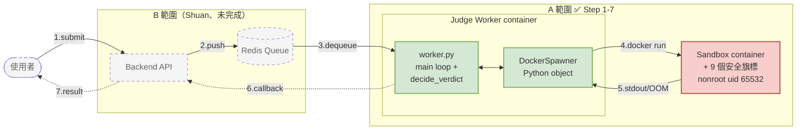

# Online Code Test — Step 1-7 架構（A 範圍：Sandbox + Compute）

這個資料夾裝期末 demo 用的架構圖。本檔給文字版（GitHub 直接渲染 Mermaid）；視覺化圖檔在 `step1-7-architecture.drawio`。

## Mermaid 版（簡潔，README / PR 用）

> 視覺 demo 用 [`step1-7-architecture.drawio`](./step1-7-architecture.drawio)。Mermaid 這版供 GitHub markdown 直接渲染。

### 三種看 Mermaid 渲染後的方式

| 方式 | 步驟 |
|---|---|
| **線上 (最快)** | 開 https://mermaid.live → 貼上面那段 code → 右邊即時渲染 |
| **GitHub** | push 到 repo 後，在 GitHub web UI 開這個 .md，自動渲染 |
| **VS Code** | 裝 `Markdown Preview Mermaid Support` 擴充，⌘+Shift+V 預覽 |

## 怎麼開 `.drawio` 視覺化版

選一種方式開 `step1-7-architecture.drawio`：

| 工具 | 怎麼開 |
|---|---|
| **線上版（最簡單）** | 開 https://app.diagrams.net → 「Open Existing Diagram」 → 選 `step1-7-architecture.drawio` |
| **VS Code 擴充套件** | 裝 `hediet.vscode-drawio` 擴充，VS Code 雙擊檔案就開 |
| **macOS 桌面版** | 下載 https://github.com/jgraph/drawio-desktop/releases，雙擊檔案 |

開起來後可以視覺化拖拉、改顏色、加註解、export 成 PNG / PDF / SVG 給 demo slide 用。

## Demo 口頭稿（教授當天照念）

### 起手 30 秒

> 我們做的是線上判題系統，分四個範圍：A 是 sandbox 安全沙盒、B 是資料管線、C 是 auth 與邊界、D 是 platform 與監控。我這邊負責 A，這張圖**只畫 A**。

### 逐步講 7 個箭頭

1. 使用者透過前端提交程式碼到 backend（B 範圍，圖上灰色虛線）
2. backend 把 submission push 進 Redis queue
3. Judge worker——一個長駐的 Python process——從 queue dequeue
4. **重點 1**：worker 不直接呼叫 docker，而是**透過 SandboxSpawner 抽象介面**——這樣未來換成 K8s Job 只要寫一個新的 `K8sJobSpawner`，worker 主流程一行不動。docker 跟 K8s 的差別、生命週期管理通通藏在 spawner 裡
5. 啟動的 sandbox container **加了 9 個安全旗標**：無網路、檔案系統 read-only、cgroup 限制 256 MB RAM 跟 64 個 process、Linux capabilities 全砍——**user code 在 sandbox 裡能做的事被嚴格限制在「跑數值計算」**
6. **重點 2**：sandbox 跑完，spawner 用 `docker inspect` 拿 OOMKilled flag——這讓我們**精確區分 MLE 跟 TLE**（exit code 137 不夠精確）
7. worker 收到 stdout / OOMKilled 後判 verdict（AC / WA / TLE / RE / CE / MLE），透過 HTTP callback 回 backend，backend 透過 SSE 把結果即時推回前端

### 結尾 30 秒

> 這個架構**從 day 1 就抽象了 spawner**——期末 demo 用 docker-compose、之後遷 AWS EKS 用同一套 worker，只要新寫一個 K8sJobSpawner——這是跨 docker / k8s 唯一不能事後補救的決定。我們也寫了 15 個 unit test 涵蓋 verdict 全分支、5 個 malicious case 親手驗證 fork bomb / memory bomb 都被擋。

### 預期問題 + 答案

| 問 | 答 |
|---|---|
| 為什麼 sandbox 用兩種 image？ | Python 用 distroless 縮 attack surface 到 92 MB；C++ 必須有 g++ 不能 distroless，所以用 debian-slim 加自建 nonroot |
| 為什麼不直接砍 docker daemon？ | daemon 全 host 共用、砍掉所有 container 都死，所以靠 cgroup pids-limit 在「fork 出來之前」就擋 |
| 測試怎麼寫？ | unit test 涵蓋 verdict pure logic（15 個 case）、integration 用 5 個 malicious code 跑真 docker 驗證旗標生效 |
| 為什麼 worker 不直接接 docker SDK？ | 因為 K8s 篇要換成 K8sJobSpawner，docker SDK 散在 worker 主流程整套要重寫；抽 interface 後只換實作 |
| Step 8 之後做什麼？ | worker 接 Redis queue + HTTP callback 串通整鏈；docker integration test 自動化；CI/CD pipeline；最後 K8s manifests |

## Component 狀態表

| 元件 | 在哪 | Step | 狀態 |
|---|---|---|---|
| Backend API（接 submission / receive callback） | `backend/main.py` placeholder | 1 | ✅ 容器跑得起來，內部邏輯由 Shuan 接 |
| Postgres（DB） | `docker-compose.yml` service | 2 | ✅ Healthcheck + volume 持久化 |
| `sandbox:python` image | `judge-sandbox/images/python/` | 5 | ✅ distroless / nonroot / digest pinned, 92 MB |
| `sandbox:cpp` image | `judge-sandbox/images/cpp/` | 5b | ✅ debian-slim / nonroot / exec PID 1, 453 MB |
| `SandboxSpawner` ABC | `judge-worker/spawner/base.py` | 6 | ✅ 抽象介面，K8s 篇換實作 worker 0 改動 |
| `DockerSpawner` | `judge-worker/spawner/docker_spawner.py` | 6 + 7 | ✅ 9 安全旗標 + OOM 偵測 + orphan sweep |
| Worker 主流程 + verdict | `judge-worker/worker.py` | 6 + 7 | ✅ judge() / decide_verdict() / SpawnerError 分流 |
| Unit test (`decide_verdict`) | `judge-worker/tests/test_decide_verdict.py` | 7 | ✅ 15 test |
| Redis queue + worker dequeue | (stub) | 8 | ⏳ 待 |
| Backend HTTP callback | (stub `print`) | 8 | ⏳ 待 |
| Docker integration test | — | 8 | ⏳ 待 |
| Frontend / Nginx / Monitoring | — | 9 | ⏳ 待 |
| GitHub Actions CI | — | 9 | ⏳ 待 |
| K8s manifests (kind / EKS) | — | 10 | ⏳ 待 |
